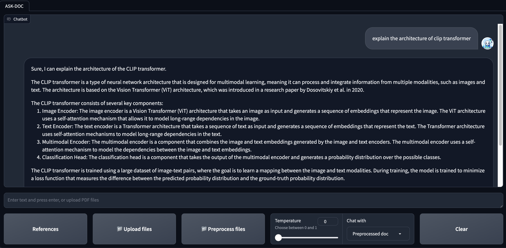
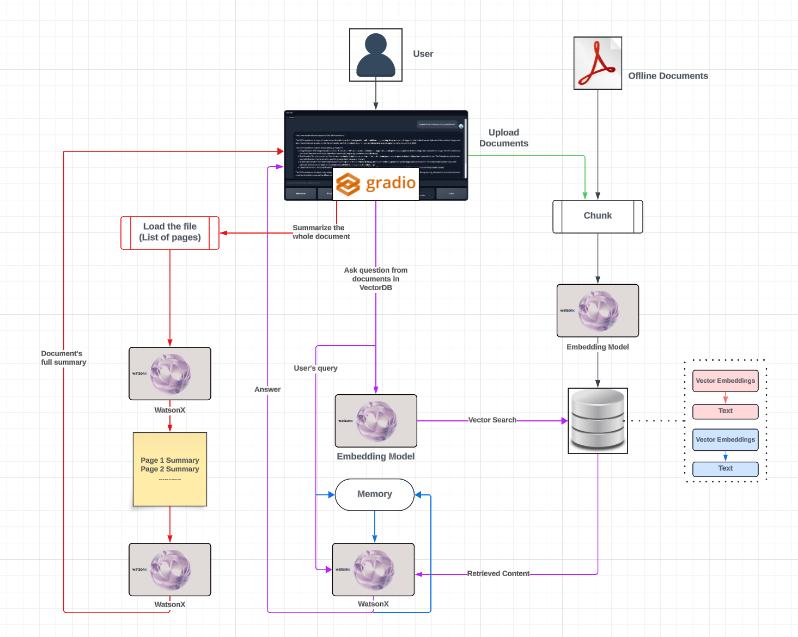

# Ask-DOC: Retrieval Augmented generation (RAG) chatbot using IBM Watsox AI Model, Langchain, ChromaDB, and Gradio

**ASK-DOC** supports PDF files.

**The chatbot offers versatile usage through three different methods:**

1. **Offline Documents**: Engage with documents that you've pre-processed and vectorized. These documents can be seamlessly integrated into your chat sessions.
2. **Real-time Uploads:** Easily upload documents during your chat sessions, allowing the chatbot to process and respond to the content on-the-fly.
3. **Summarization Requests:** Request the chatbot to provide a comprehensive summary of an entire PDF or document in a single interaction, streamlining information retrieval.

To employ any of these methods, simply configure the appropriate settings in the "RAG with" dropdown menu within the chatbot interface. Tailor your interactions with documents to suit your preferences and needs efficiently.

- The project provides guidance on configuring various settings, such as adjusting the GPT model's temperature for optimal performance.
- The user interface is crafted with gradio, ensuring an intuitive and user-friendly experience.
- The model incorporates memory, retaining user Q&As for an enhanced and personalized user experience.
- For each response, you can access the retrieved content along with the option to view the corresponding PDF.

## ASK-DOC User Interface

<div align="center">
  
</div>

## Project Schema

<div align="center">
  
</div>

- NOTE: This project is currently set up as a **demo**. As such, the document management is simplified and not suitable for production environments.

## Document Storage

Documents are stored in two separate folders within the `data` directory:

- `data/docs_2`: For files that you want to **upload**.
- `data/docs`: For files that should be **processed in advance**.

## Database Creation

Vector databases (vectorDBs) are generated within the `data` folder, facilitating the project's functionality.

## Running the Project

To run the projects, you will need to install the required libraries. Follow the steps below to get started:

1. Clone the repository and navigate to the project directory.

```
git clone https://github.com/IBM/watsonx-rag-ask-doc.git
cd <yourproject>
```

2. Create a new virtual environment using a tool like virtualenv or conda, and activate the environment:

```
python3 -m venv <name_of_virtual_env>
source /venv/bin/activate
```

3. Install the required libraries using the following commands:

```
pip install -r requirements.txt
```

4. Then

```
cd <to project directory>
```

5. Open configs/app_config.yml and fill your IBM WatsonX API Key

```
genai_api_key: <IBM WatsonX API Key>
```

6. Run the application

```
python src/askdoc.py
```
